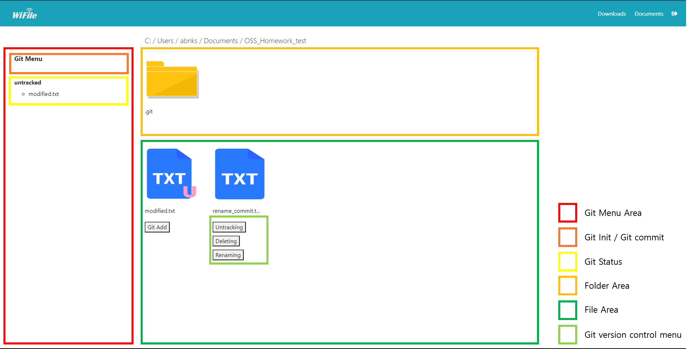
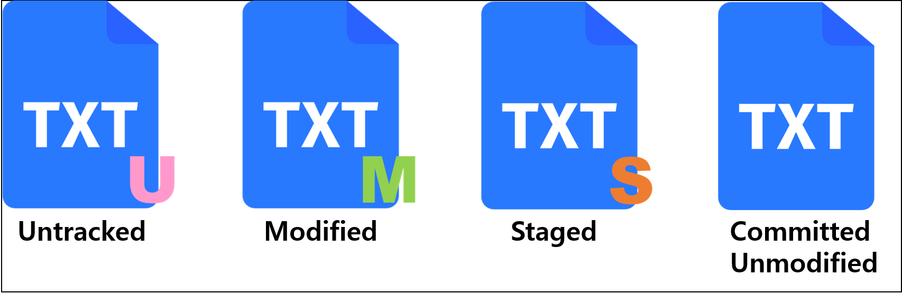

# OSS_Term_Project_18
Repository for Chungang UNIV. Dept. of SW OSS term project team 18

We started our project based on &lt;WIFIle&gt;
[Github address](https://github.com/reallyrehan/flask-fileexplorer)

This project is based on MIT License

* Why we selected this license?:
  &mdash; First, following base file explorer program's license, we selected MIT License.
  &mdash; Furthermore, we found that there is lots of groups to try implementation of git to existing file system. To contribute other developer group, even it's small amount,we selected MIT License.

This is how to use our &lt;FMOS(File manager with Open Source)&gt;

--------------

## How to start

0. python version
			```
			python version >= 3.8
			```
1. Clone this project
    ```shell
    git clone https://github.com/cokestrawberry/OSS_Term_Project_18.git
    ```

2. Install library(in flask-fileexplorer folder)
 * If you are not in flask-fileexplorer folder, do 'cd' command
    ```shell
    cd flask-fileexplorer
    pip install -r requirements.txt
    ```

3. Run file manager program
    ```python
    python setup.py
    ```
 * If you enter this command, you can get a IPv4 address as return. That is your file manager address. Do ctrl + click or copy that address, paste on web-browser and enter.

 * Alternatively, it can be accessed through the loopback address (127.0.0.1:80).

 * Then, you can see your C: directory. You can browse by click folder or add local address of your directory behind the address.

4. Set Downloads/Documents folder (Optional, Not neccessaty)

    You will have to configure the config.json file with your paths
    ```
    "Favorites":    ["C://Users//Administrator//Documents","C://Users//Administrator//Downloads"],
    ```
------------------
## How to use

With name of command on buttons, you can intuitively know how to use.

* git init
  - If there is no '.git repository' in the current folder, that is, if the folder is not under version control with git, the git init menu is displayed on the left.
  - On left side, you can see 'git init' button.
  - If you press that, .git will be generated.

* git add
  - With files which is untracked, there is U sign on icon's right-bottom side.
  - Below the icon, there is 'git add' button.
  - If you press that, 'git add' command will excute and at the left side bar(for status), staged list will be shown.

* git restore
  - If the file is in a modified or staged state, a 'git restore' button is provided.
  - When you click the button, 'git restore --staged' or 'git restore' will be executed depending on the state of the file.
    - 'git restore --staged': Executes when a file is uploaded to the staging area.
    - 'git restore': The file is not uploaded to the staging area and is executed in a modified state.

* git commit
  - Above the left side bar, you can do commit if there is any staged files.
  - When you click commit button, text box for commit message will be genereted.
  - After fill in it with your commit message, press the enter key, or press the commit button to commit.

* git mv
  - For easy version control, the mv menu is only available when file is committed or unmodified state.
  - Clicking the button creates a text box where you can enter the name to be modified.
  - Enter the name to be modified, including the extension, in the text box and press the Enter key or click the renaming button to execute the git mv command.

* git rm
  - 'git rm' deletes files from both git and working directory, 'git rm --cached' deletes files only from git and makes them untracked. So, a separate menu is provided.
  - 'git rm --cached': It works by pressing the Untracking button.
  - 'git rm': It works by pressing the Delete button.

------------
## Implemetation

* file system analysis : &lt;WIFIle&gt;
[Github address](https://github.com/reallyrehan/flask-fileexplorer)
  * features: Python Web App.
    - License: MIT
    
    - Language: Python

    - Platform: Windows / Mac / Linux
    
      => We only developed and tested Windows in consideration of the development environment of our team members.

    - Frameworks: Flask / Bootstrap4

      => Flask: run the server, serve up the html pages
      => Bootstrap4: show the folders and the files

  * How to change
    - icon:

        file icons -> ./static/files_icon/*

        folder icon -> ./static/folder5.png
    - html:

        main page -> ./templates/home.html

    - main logic: setup.py
        
        Responding to route movement, event invocation, etc. can be composed of the following template.

        ```python
        @app.route('/route/', methods=['POST'])
        @app.route('/route/<path:var>', methods=['POST'])
        def function_name(var=""):
            ~~~

            return render_template(~~~)
        ```
        Use decorators to respond to calls to specific routes.
        
        The return value for the call is render_template(~~) that renders html.

* UI
  
  
  

* Discussion
  - License

    => MIT

    : First, following base file explorer program's license, we selected MIT License.
    Furthermore, we found that there is lots of groups to try implementation of git to existing file system. To contribute other developer group, even it's small amount, we selected MIT License.

  - Expression method when one file has multiple states

    => Parsing the execution result of git status into a table
    
    : There have been many discussions, such as how to express multiple statuses together, how to prioritize statuses and express only the status with the highest priority, but in the end, it was determined by git that following the results of git status was the most accurate. Therefore, the result of git status is parsed and displayed.

    Icons are displayed in the order of untracked, modified, staged, and committed in order of priority.


* Project Progress method
  
  1. Modify the filesystem make possible to add git commands.

  2. Parallel development of functions
    
      Each function is related to the state of the file and affects each other, but the function itself operates independently and unrelated to each other, so parallel development is possible.

      | Name | Task |
      |:---:|:--|
      |김서해|init / add|
      |김승진|initial work(1) / commit|
      |임종승|rm / mv|
      |허지범|restore|

  3. Merge and maintenance
    
      Since each function operates independently of each other, there is a low possibility of conflict when merging in logical operation (setup.py). However, in the process of editing html, there may be errors in UI implementation, such as changing the order of buttons during merge.

      Therefore, after everyone has completed development, proceed with the merge
      Create a "maintenance" branch to hotfix errors on the UI.